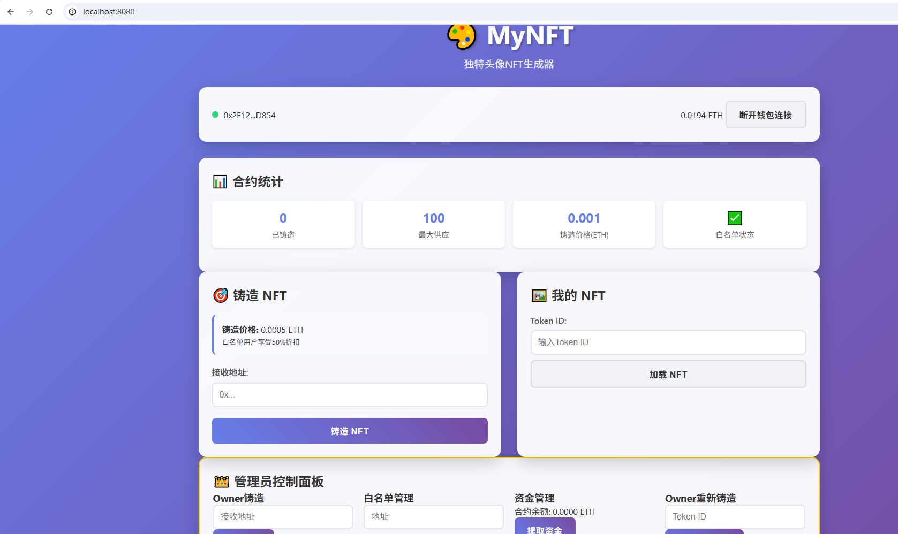
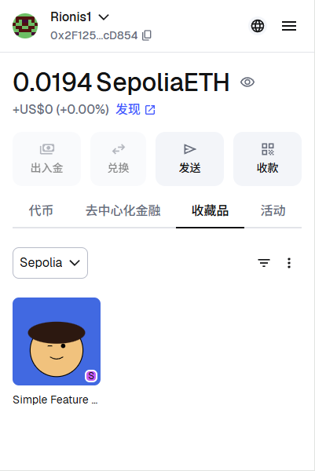

# MyNFT Project
## 📖项目介绍
一个基于foundry框架的随机生成NFT项目，最终经过测试之后部署到sepolia测试网为自己的metamask账户铸造NFT
## ✨核心特点
- **动态生成** 动态生成独特的SVG NFT
- **唯一性** 哈希确保NFT特征唯一
- **重新铸造** 用户可以选择重新铸造NFT特征
- **稀有度机制** NFT背景颜色有不同的出现概率
- **白名单机制** 赋予白名单用户特权
- **管理员机制** 合约owner能操控白名单及铸币
## 🛠技术栈
- Solidity（合约开发）
- Foundry（合约测试与部署）
- ethers.js（前端与合约交互）
- HTML/CSS/JS（前端页面）
- OpenZeppelin（合约安全库）
## 展示

### 如有建议或漏洞，欢迎PR！
